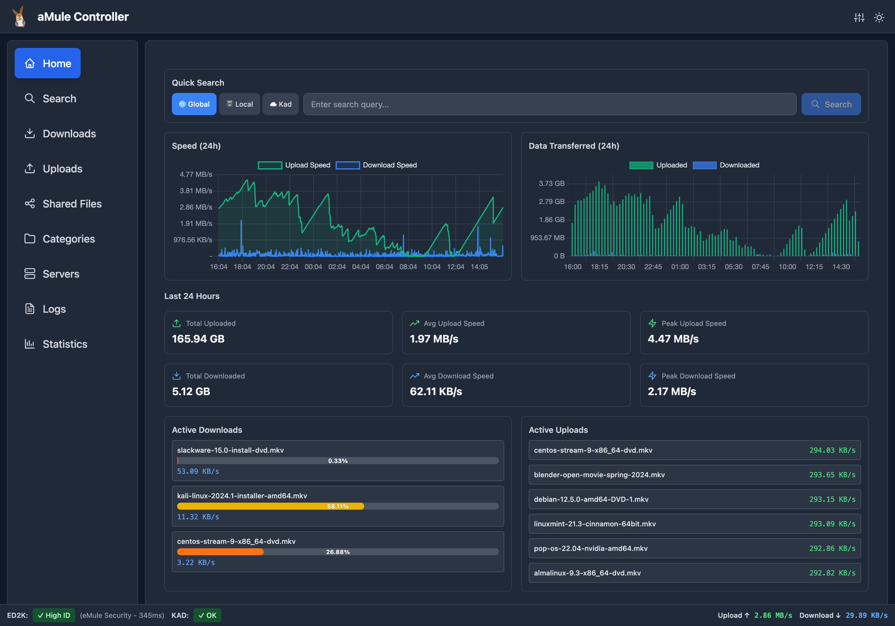
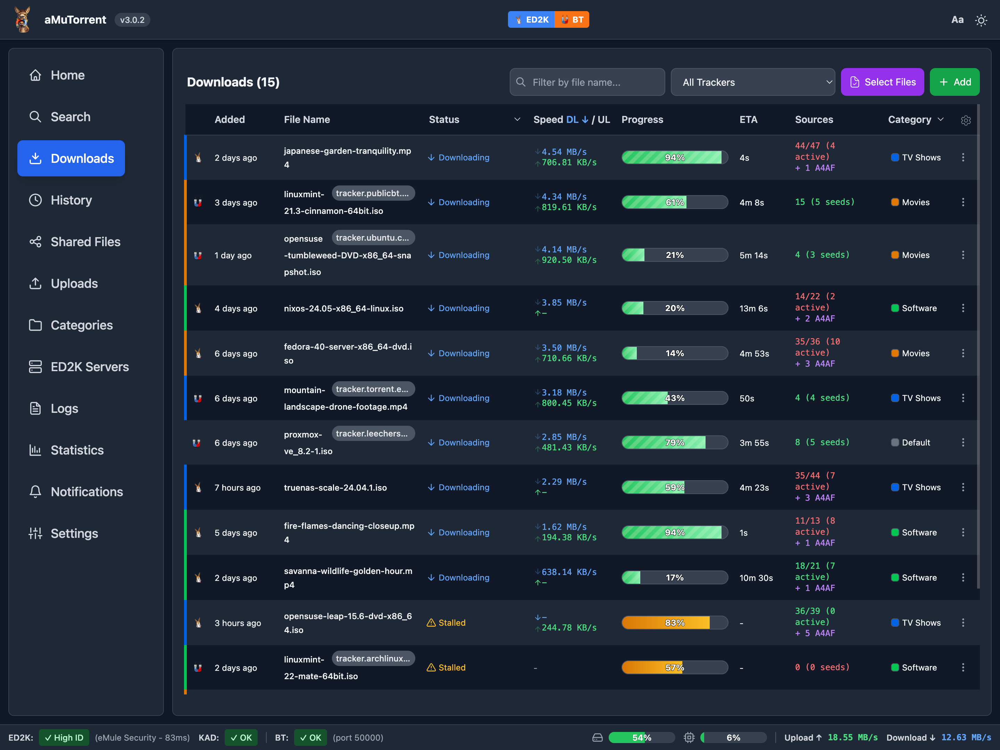
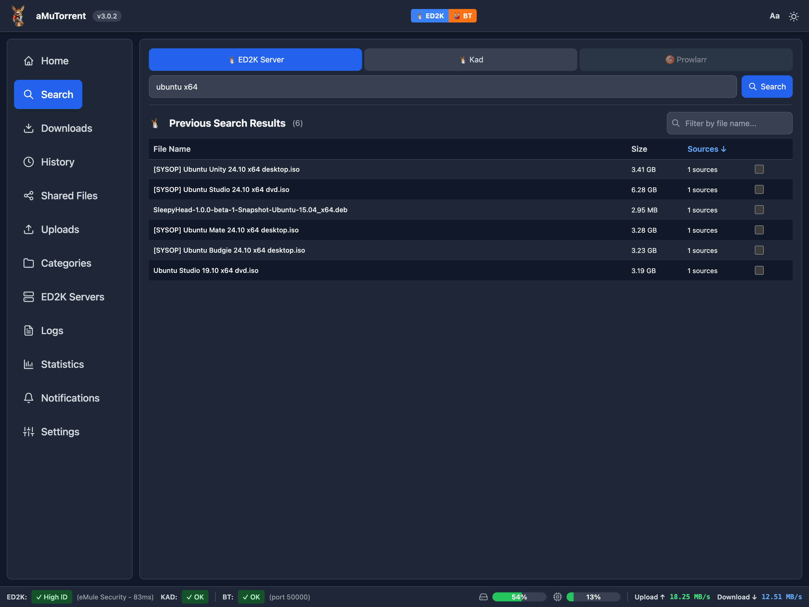
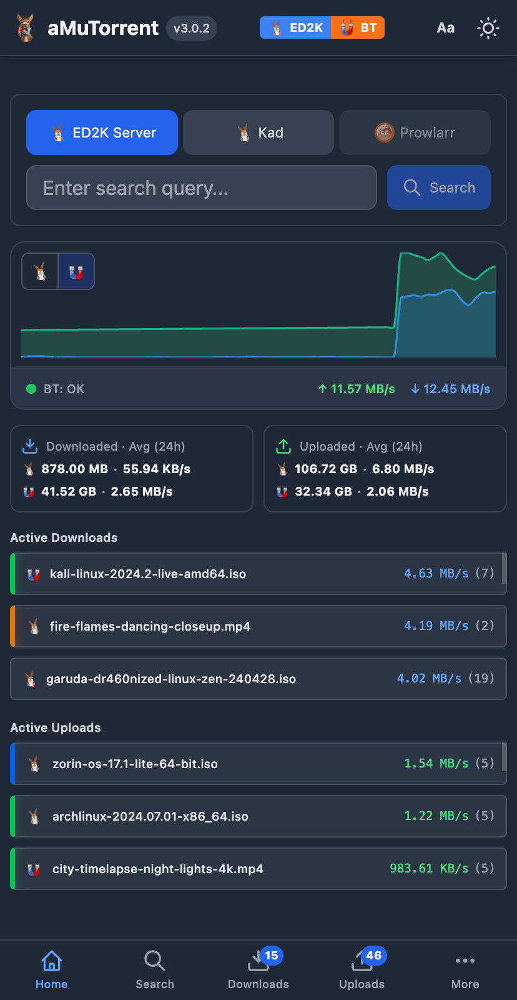
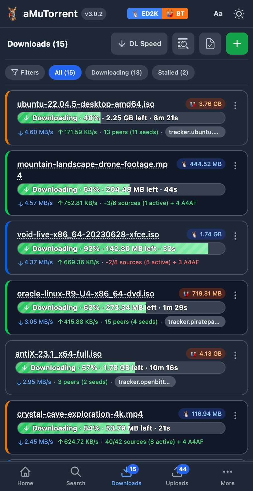
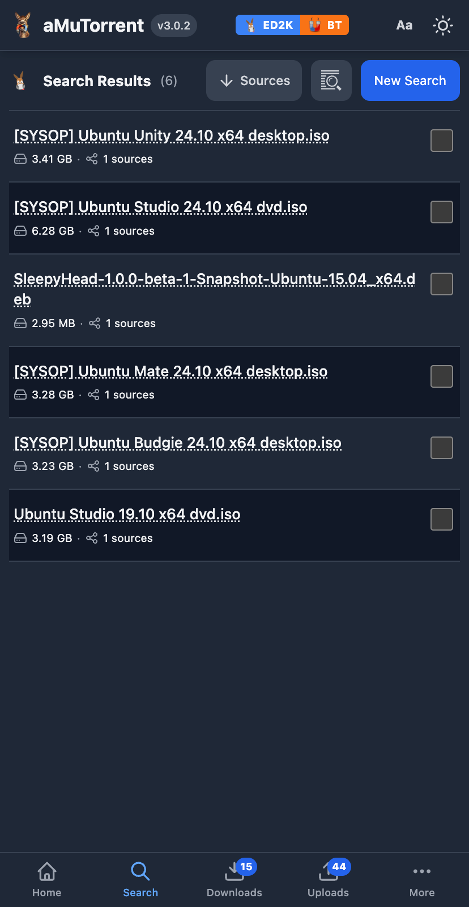

<p align="center">
  
</p>

<h1 align="center">aMuTorrent</h1>

A unified download manager for aMule, rTorrent, qBittorrent, Deluge, and Transmission. Manage ED2K and BitTorrent downloads from a single modern web interface. Features multi-instance support, user management with SSO, Prowlarr integration for torrent search, Torznab indexer and qBittorrent-compatible API for aMule (Sonarr/Radarr integration), push notifications via Apprise, and GeoIP peer location display. Built with Node.js, WebSockets, and React.



## Features

### Multi-Client Support
- **aMule Integration** - Control aMule via the EC (External Connection) protocol
- **rTorrent Integration** - Connect to rTorrent via XML-RPC over HTTP
- **qBittorrent Integration** - Connect to qBittorrent via WebUI API
- **Deluge Integration** - Connect to Deluge via WebUI JSON-RPC
- **Transmission Integration** - Connect to Transmission via HTTP RPC
- **Multi-Instance** - Run multiple instances of the same client type
- **Unified Interface** - Manage all clients from a single dashboard

### Download Management
- **Real-time Search** - Search ED2K/Kad network and Prowlarr indexers
- **Download Control** - Pause, resume, and delete downloads
- **Category Management** - Organize downloads with color-coded categories and path mapping
- **Batch Operations** - Select multiple items for bulk actions
- **File Operations** - Move downloads to category paths
- **User Management** - Multi-user authentication, capabilities, and trusted proxy SSO

### Integrations
- **Prowlarr Search** - Search torrents across multiple indexers (results go to any connected BitTorrent client)
- **Sonarr/Radarr** - Torznab indexer and qBittorrent-compatible API for aMule
- **Push Notifications** - Apprise integration for 80+ notification services
- **Custom Event Scripts** - Run your own scripts on download events

### Monitoring
- **Upload Tracking** - Monitor active uploads with GeoIP location display
- **Shared Files** - View and manage shared files
- **Historical Statistics** - Interactive charts for speed and transfer history (24h/7d/30d)
- **Download History** - Track completed downloads with filtering

### User Experience
- **Dark Mode** - Automatic theme switching based on system preference
- **Responsive Design** - Works on desktop, tablet, and mobile
- **Configurable Tables** - Show/hide and reorder columns per view
- **WebSocket Updates** - Real-time updates without polling

---

## Quick Start (Docker)

**Prerequisites:** At least one of: aMule with External Connections enabled, rTorrent with XML-RPC over HTTP, qBittorrent with WebUI enabled, Deluge with WebUI enabled, or Transmission with RPC enabled.

### 1. Pull the image

Available on [Docker Hub](https://hub.docker.com/r/g0t3nks/amutorrent). Supports `linux/amd64` and `linux/arm64`.

```bash
docker pull g0t3nks/amutorrent:latest
```

### 2. Create directories

```bash
mkdir -p data logs
sudo chown -R 1000:1000 data logs
```

### 3. Create `docker-compose.yml`

```yaml
services:
  amutorrent:
    image: g0t3nks/amutorrent:latest
    user: "1000:1000"
    container_name: amutorrent
    ports:
      - "4000:4000"
    environment:
      - NODE_ENV=production
      - PORT=4000
    extra_hosts:
      - "host.docker.internal:host-gateway"
    volumes:
      - ./logs:/usr/src/app/server/logs
      - ./data:/usr/src/app/server/data
    restart: unless-stopped
```

### 4. Start and configure

```bash
docker compose up -d
```

Open `http://localhost:4000` and follow the setup wizard to configure your download clients.

> **All-in-One Setup:** For a complete setup with aMule, rTorrent, and qBittorrent in Docker, see [docker-compose.all-in-one.yml](docker-compose.all-in-one.yml)

---

## Native Installation

```bash
# Clone repository
git clone https://github.com/got3nks/amutorrent.git
cd amutorrent

# Install and build
cd server && npm install && cd ..
npm install && npm run build

# Start server
node server/server.js
```

Open `http://localhost:4000` and complete the setup wizard.

---

## Documentation

| Document | Description |
|----------|-------------|
| [Configuration Guide](./docs/CONFIGURATION.md) | Setup wizard, settings, environment variables |
| [aMule Integration](./docs/AMULE.md) | Connect to aMule via EC protocol |
| [rTorrent Integration](./docs/RTORRENT.md) | Connect to rTorrent via XML-RPC |
| [qBittorrent Integration](./docs/QBITTORRENT.md) | Connect to qBittorrent via WebUI API |
| [Deluge Integration](./docs/DELUGE.md) | Connect to Deluge via WebUI JSON-RPC |
| [Transmission Integration](./docs/TRANSMISSION.md) | Connect to Transmission via HTTP RPC |
| [Prowlarr Integration](./docs/PROWLARR.md) | Search torrents via Prowlarr indexers |
| [Notifications](./docs/NOTIFICATIONS.md) | Push notifications via Apprise (80+ services) |
| [Custom Scripting](./scripts/README.md) | Run custom scripts on download events |
| [GeoIP Setup](./docs/GEOIP.md) | Display peer locations with MaxMind databases |
| [Sonarr/Radarr Integration](./docs/INTEGRATIONS.md) | Complete guide for *arr applications setup |
| [User Management](./docs/USERS.md) | Authentication, capabilities, SSO, and API keys |
| [API Reference](./docs/API.md) | REST API and WebSocket protocol |
| [Development Guide](./docs/DEVELOPMENT.md) | Building, project structure, contributing |

---

## Screenshots

<details>
<summary>Desktop Screenshots</summary>





</details>

<details>
<summary>Mobile Screenshots</summary>

<div style="display: flex; gap: 10px; flex-wrap: wrap;">
  
  
  
</div>

</details>

---

## Troubleshooting

**Can't connect to aMule?**
- Verify EC is enabled in aMule: Preferences → Remote Controls → External Connections
- Check the EC password is correct
- Ensure firewall allows port 4712

**Can't connect to rTorrent?**
- Ensure XML-RPC is exposed over HTTP (nginx/lighttpd proxy or ruTorrent)
- Test with: `curl http://host:port/RPC2`
- See [rTorrent Integration](./docs/RTORRENT.md) for setup details

**Can't connect to qBittorrent?**
- Verify WebUI is accessible: `curl http://host:8080/api/v2/app/version`
- New installs generate a random password - check container logs: `docker logs qbittorrent`
- See [qBittorrent Integration](./docs/QBITTORRENT.md) for setup details

**Can't connect to Deluge?**
- Verify WebUI is accessible: `curl -X POST http://host:8112/json`
- Default password is `deluge` — check if it was changed
- See [Deluge Integration](./docs/DELUGE.md) for setup details

**Can't connect to Transmission?**
- Verify RPC is accessible: `curl http://host:9091/transmission/rpc` (a 409 response means RPC is working)
- Check username/password if RPC authentication is enabled
- See [Transmission Integration](./docs/TRANSMISSION.md) for setup details

**Docker: Can't reach services on host?**
- Ensure `extra_hosts` is set in docker-compose.yml
- Use `host.docker.internal` as the hostname

**Notifications not working?**
- Verify Apprise is installed: `apprise --version`
- Test your service configuration via the Notifications page
- See [Notifications Guide](./docs/NOTIFICATIONS.md) for setup details

**Sonarr/Radarr can't find downloaded files?**
- Configure categories with correct download paths
- Set up Remote Path Mappings if using Docker
- See [Integration Guide](./docs/INTEGRATIONS.md) for details

**More help:** Check server logs or open an [issue](https://github.com/got3nks/amutorrent/issues).

---

## License

MIT License - see [LICENSE](LICENSE) for details.
