# aMule Web Controller

A modern, real-time web interface for controlling aMule via the EC (External Connection) protocol. Built with Node.js, WebSockets, and React.

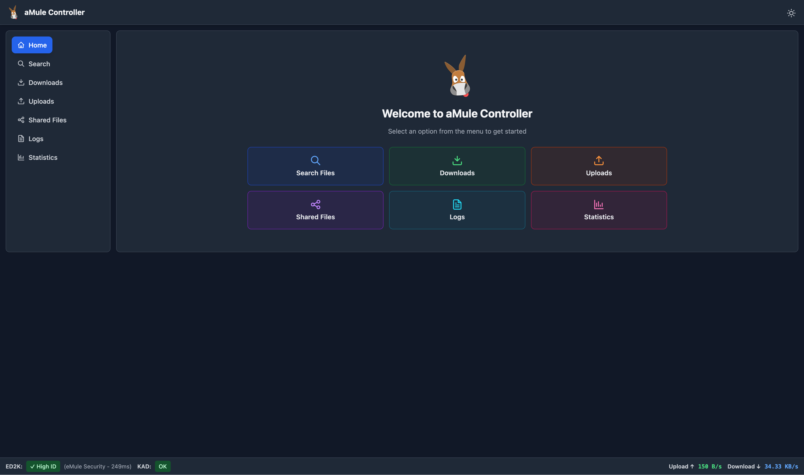

## Features

- 🔍 **Real-time Search** - Search the ED2K/Kad network with live results
- 📥 **Download Management** - Monitor and control active downloads
- 📤 **Upload Monitoring** - Track active uploads and queue
- 📁 **Shared Files** - View and manage shared files
- 📊 **Statistics** - Detailed statistics with collapsible tree view
- 📋 **Logs** - Server info and application logs viewer
- 🌓 **Dark Mode** - Automatic theme switching
- 📱 **Responsive Design** - Works on desktop, tablet, and mobile
- ⚡ **WebSocket Updates** - Real-time updates without polling

## Prerequisites

### For All Installations:
- **aMule daemon** (amuled) with EC (External Connection) protocol enabled

### For Docker Installation (Recommended):
- **Docker** 20.10+
- **Docker Compose** 1.29+

### For Native Installation:
- **Node.js** 18+ 
- **npm** (comes with Node.js)
- **git** (required for dependency installation)

## Installation

### 🐳 Docker Installation (Recommended)

1. **Clone the repository**
```bash
git clone https://github.com/got3nks/amule-web-controller.git
cd amule-web-controller
```

2. **Create environment file**
```bash
cp .env.example .env
```

Edit `.env` and configure your aMule connection:
```env
NODE_ENV=production
PORT=4000
AMULE_PORT=4712
AMULE_PASSWORD=your_ec_password
```

**Note:** You should not set the `AMULE_HOST` variable as it's already configured in the Docker Compose files.

3. **Build and run**
```bash
# if you have an aMule istance already running on your host
docker-compose -f docker-compose.standalone.yml up -d

# OR, if you want to use the included aMule container
docker-compose up -d
```

The web interface will be available at `http://localhost:4000`

### 📦 Native Installation

**Prerequisites:**
- Node.js 18+
- npm
- git (required for installing dependencies)

1. **Clone the repository**
```bash
git clone https://github.com/got3nks/amule-web-controller.git
cd amule-web-controller
```

2. **Install EC Protocol dependency**
```bash
cd server
npm install
```

This will automatically install the [amule-ec-node](https://github.com/got3nks/amule-ec-node) library from GitHub.

3. **Build frontend assets**
```bash
cd ..
npm install
npm run build:css
```

4. **Set environment variables**
```bash
export AMULE_HOST=127.0.0.1
export AMULE_PORT=4712
export AMULE_PASSWORD=your_ec_password
export PORT=4000
```

5. **Start the server**
```bash
node server/server.js
```

The web interface will be available at `http://localhost:4000`

## Configuration

### aMule EC Setup

1. Enable External Connections in aMule:
   - Open aMule preferences
   - Go to "Remote Controls" → "External Connections"
   - Enable "Accept external connections"
   - Set a password
   - Note the port (default: 4712)

2. Configure the web controller to connect to your aMule instance using environment variables.

### Environment Variables

| Variable | Default | Description |
|----------|---------|-------------|
| `PORT` | `4000` | Web server port |
| `AMULE_HOST` | `127.0.0.1` | aMule daemon hostname/IP |
| `AMULE_PORT` | `4712` | aMule EC port |
| `AMULE_PASSWORD` | `admin` | aMule EC password |
| `NODE_ENV` | `development` | Node environment |

## Development

### Frontend Development
```bash
# Watch and rebuild CSS on changes
npm run watch:css
```

### Server Development
```bash
cd server
npm run dev  # Uses nodemon for auto-restart
```

### Project Structure
```
.
├── server/
│   ├── server.js          # WebSocket server & Express app
│   └── package.json       # Server dependencies
├── static/
│   ├── app.js            # React frontend
│   ├── index.html        # HTML entry point
│   └── output.css        # Built Tailwind CSS
├── src/
│   └── input.css         # Tailwind source
├── Dockerfile            # Multi-stage Docker build
├── docker-compose.yml    # Docker Compose configuration
└── package.json          # Frontend build dependencies
```

## Dependencies

### Backend
- **[express](https://expressjs.com/)** - Web framework
- **[ws](https://github.com/websockets/ws)** - WebSocket server
- **[amule-ec-node](https://github.com/got3nks/amule-ec-node)** - aMule EC protocol implementation

### Frontend
- **React 18** - UI framework (loaded via CDN)
- **Tailwind CSS** - Utility-first CSS framework

## API / WebSocket Protocol

The server exposes a WebSocket endpoint for real-time communication:

### Client → Server Actions
```javascript
// Search
{ action: 'search', query: 'file name', type: 'global' }

// Get downloads
{ action: 'getDownloads' }

// Get uploads
{ action: 'getUploadingQueue' }

// Get shared files
{ action: 'getShared' }

// Get statistics
{ action: 'getStats' }
{ action: 'getStatsTree' }

// Get logs
{ action: 'getLog' }
{ action: 'getServerInfo' }

// Download file
{ action: 'download', fileHash: '...' }

// Delete file
{ action: 'delete', fileHash: '...' }
```

### Server → Client Messages
```javascript
// Search results
{ type: 'search-results', data: [...] }

// Downloads update
{ type: 'downloads-update', data: [...] }

// Stats update
{ type: 'stats-update', data: {...} }

// And more...
```

## Screenshots


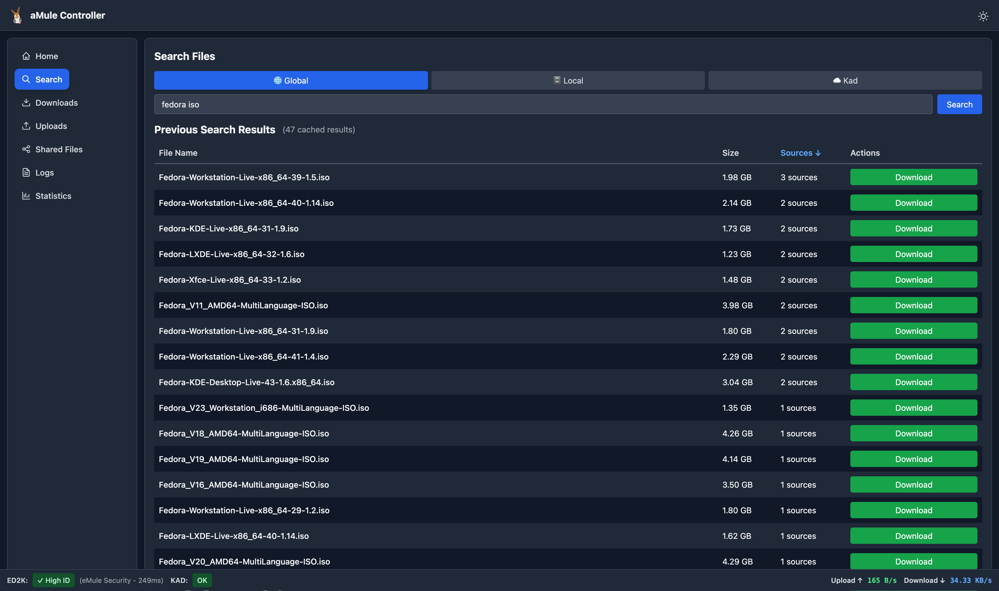
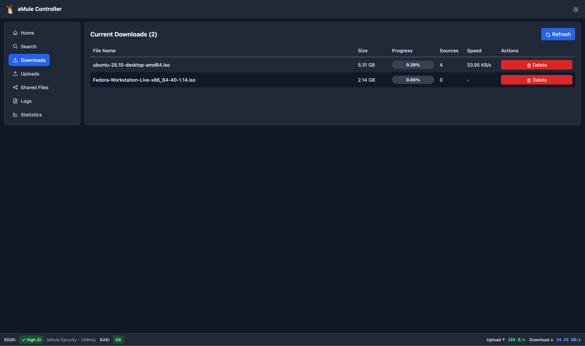
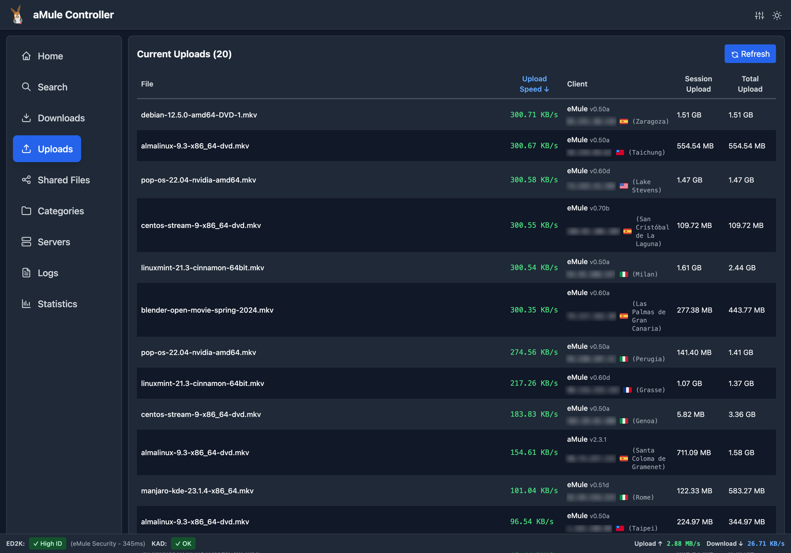
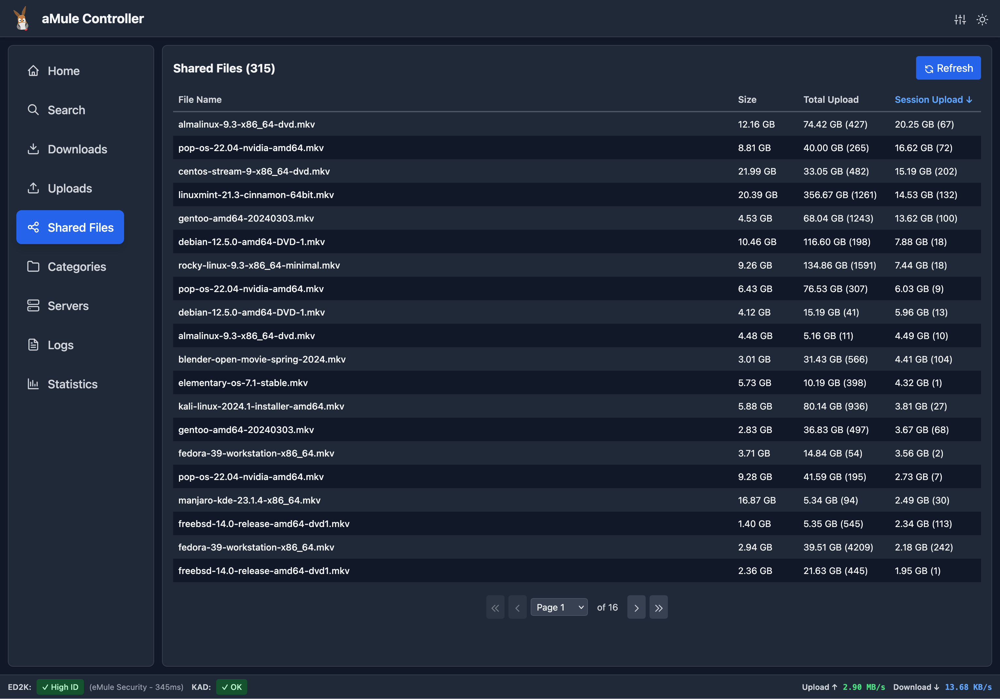
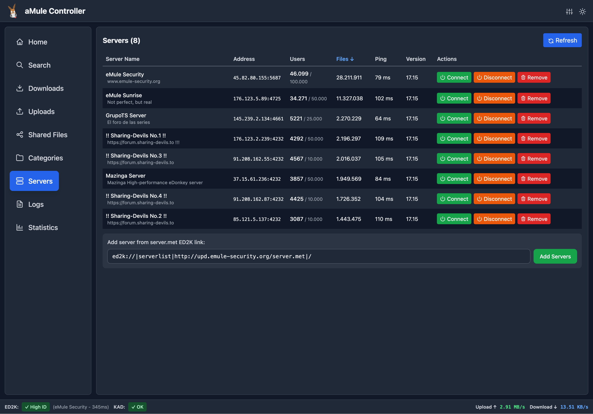
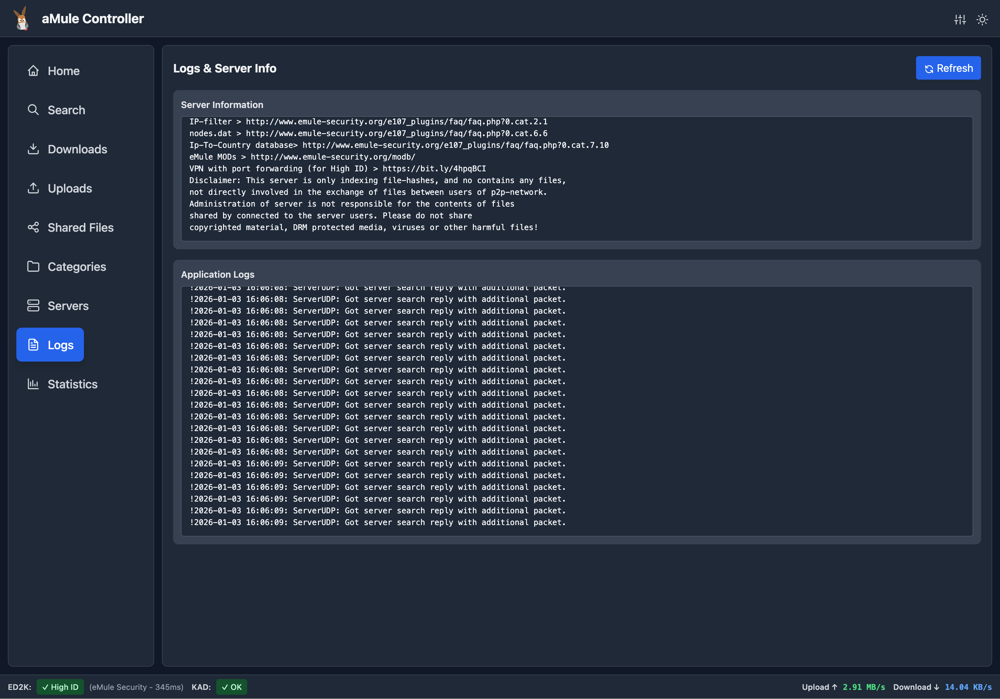
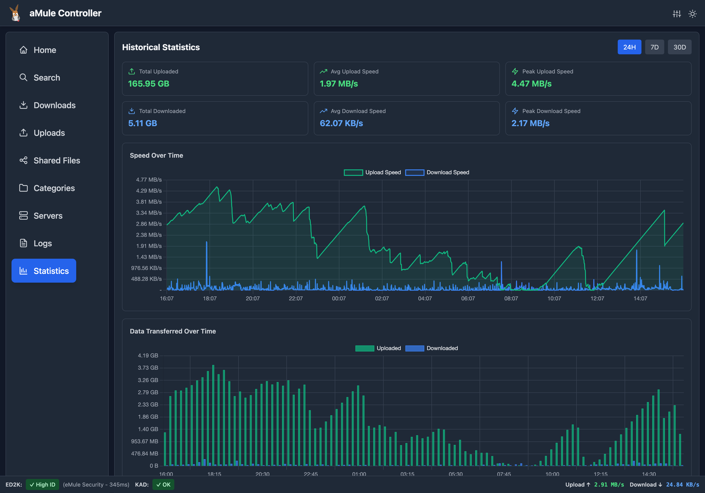

## Screenshots (Mobile)

<div style="display: flex; gap: 10px;">
  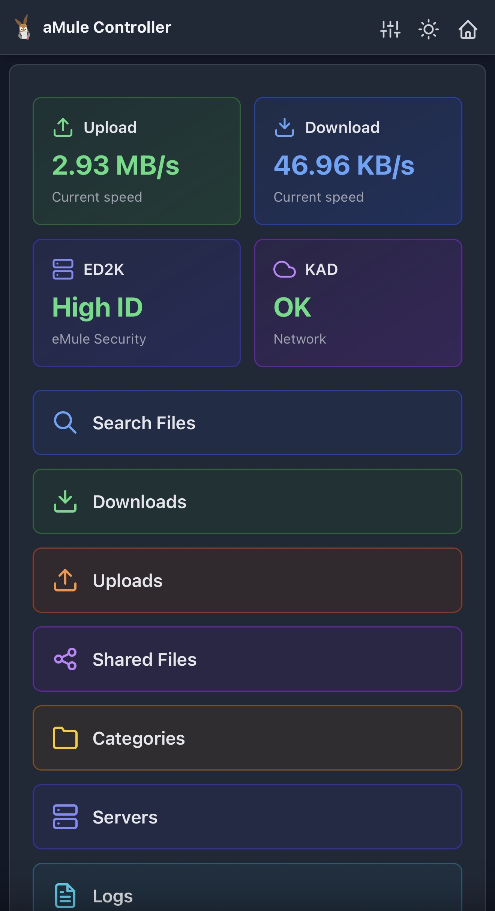
  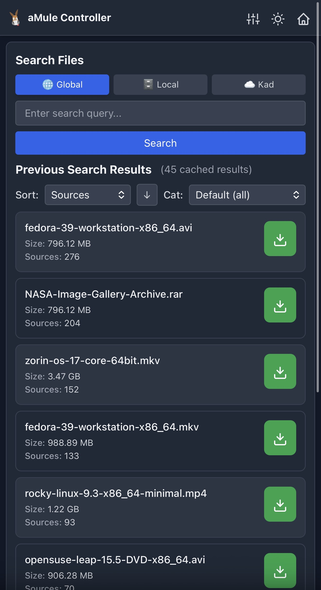
  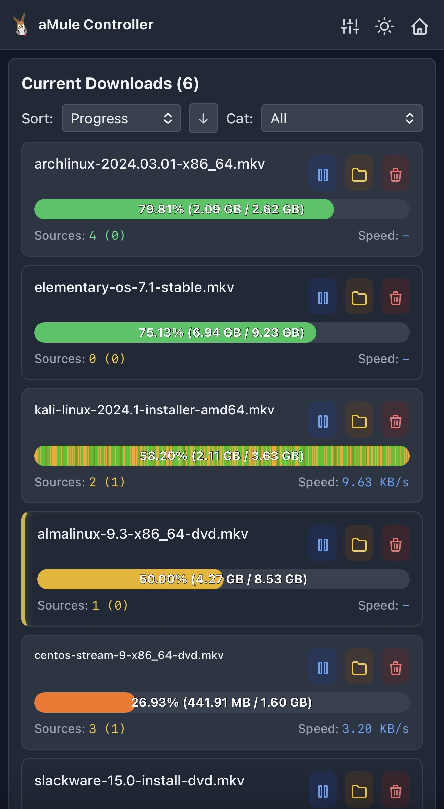
  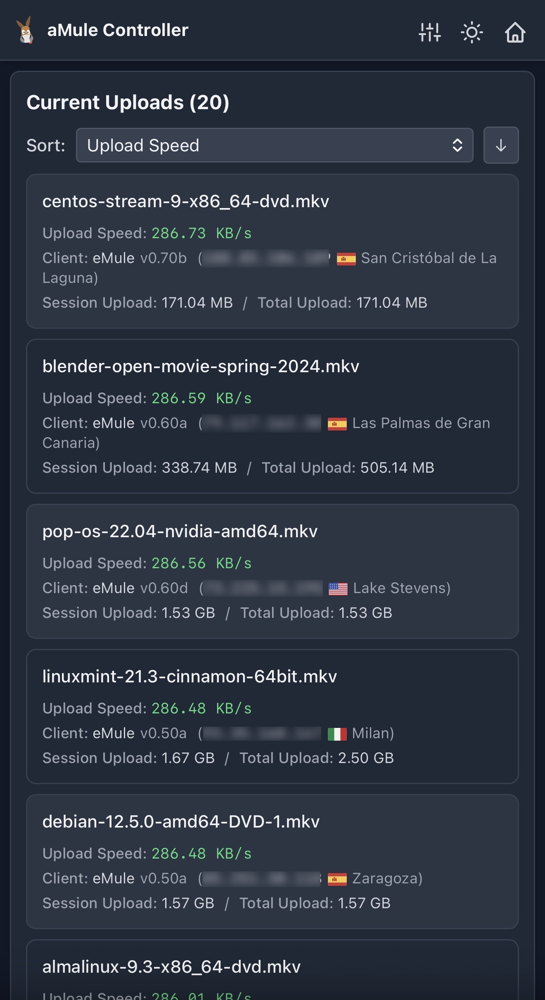
  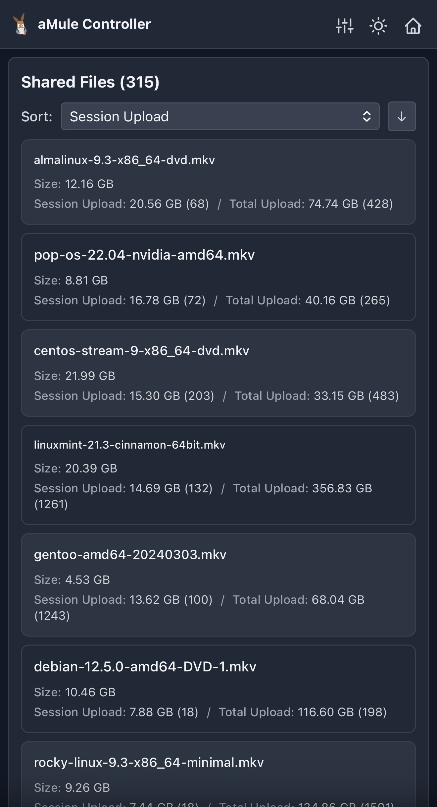
  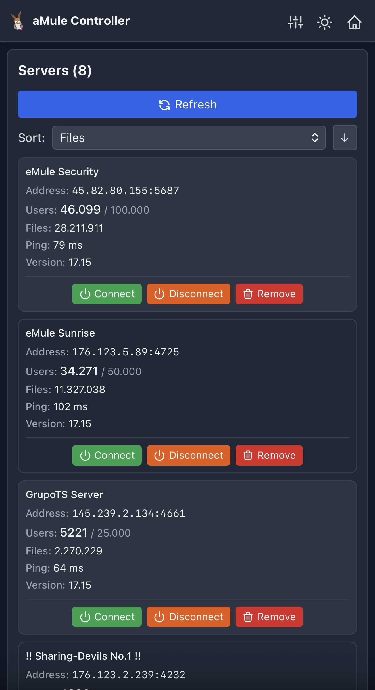
  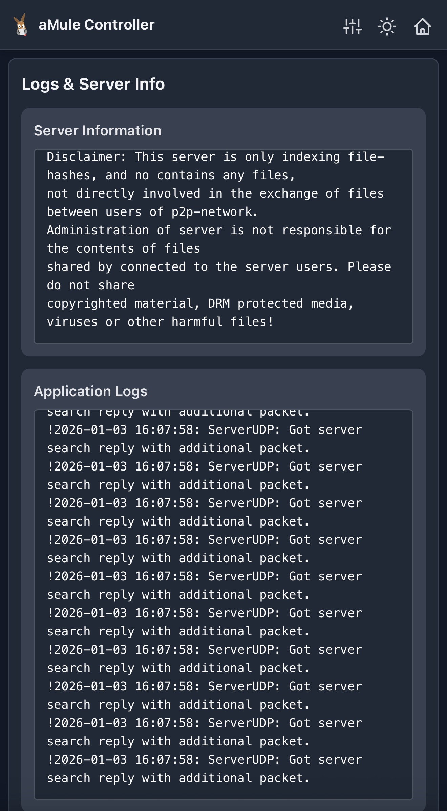
  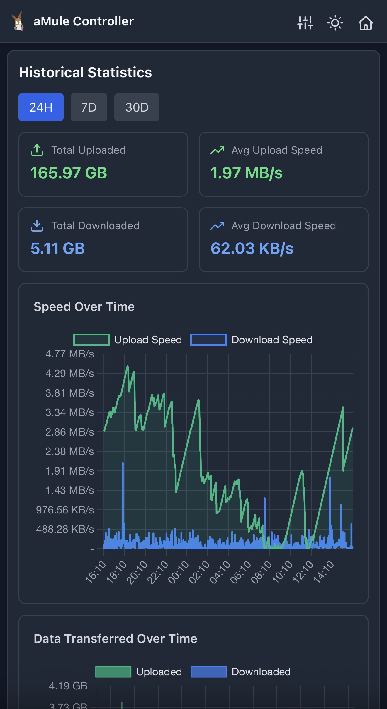
</div>

## Troubleshooting

### Git not found during npm install
If you see `npm error syscall spawn git` or `ENOENT git`, you need to install git:

**Ubuntu/Debian:**
```bash
sudo apt-get install git
```

**macOS:**
```bash
brew install git
```

**Windows:**
Download from https://git-scm.com/download/win

Then retry: `npm install`

### Can't connect to aMule
- Verify aMule EC is enabled and running
- Check the EC password is correct
- Ensure firewall allows connection to EC port
- Check aMule logs for connection attempts

### WebSocket disconnects frequently
- Check network stability
- Verify aMule daemon is running
- Check server logs in `logs/server.log`

### Frontend not loading
- Ensure CSS was built: `npm run build:css`
- Check browser console for errors
- Verify static files are served correctly

## License

This project is licensed under the MIT License - see the [LICENSE](LICENSE) file for details.
